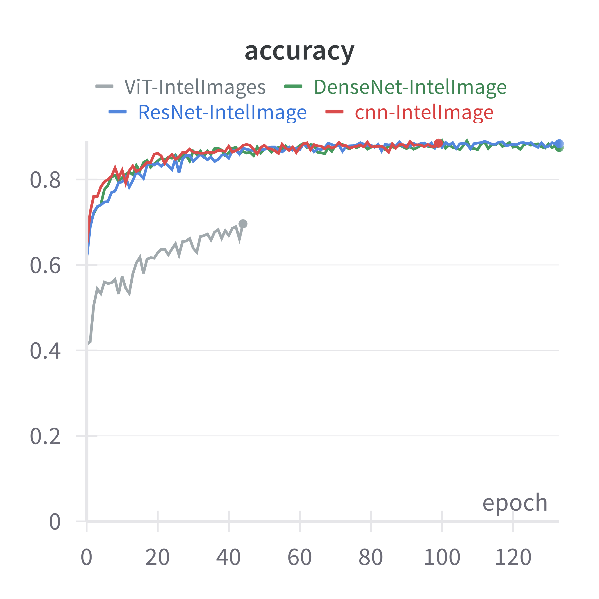
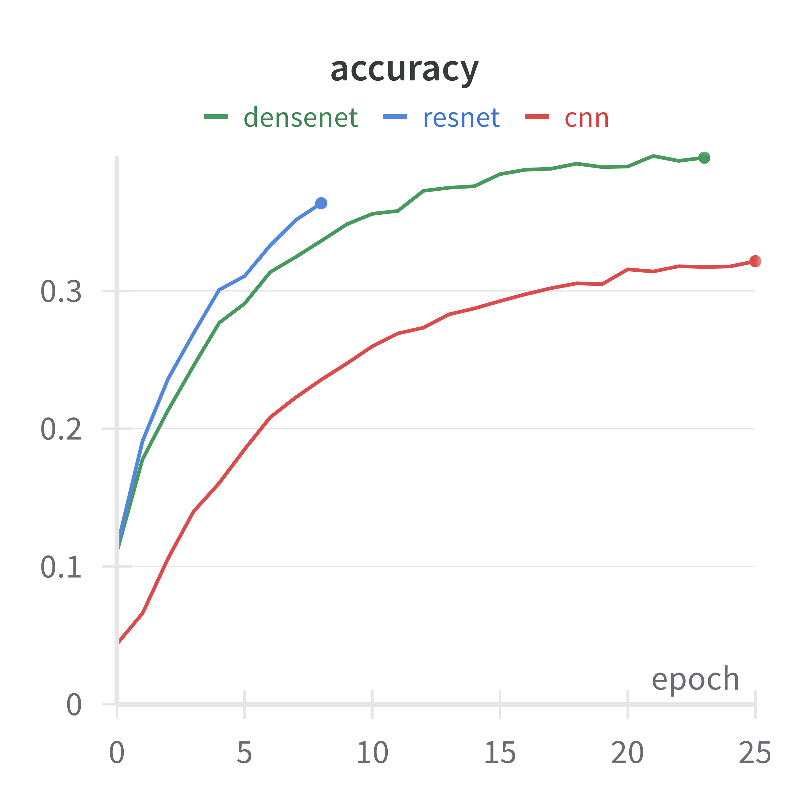
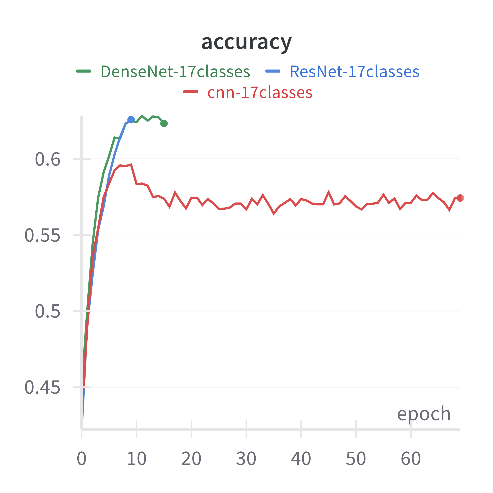
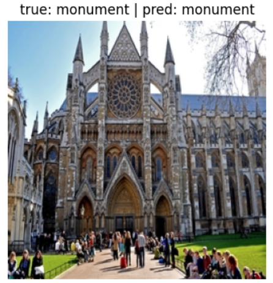
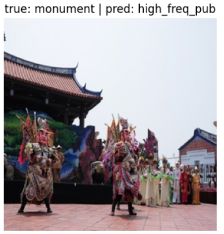
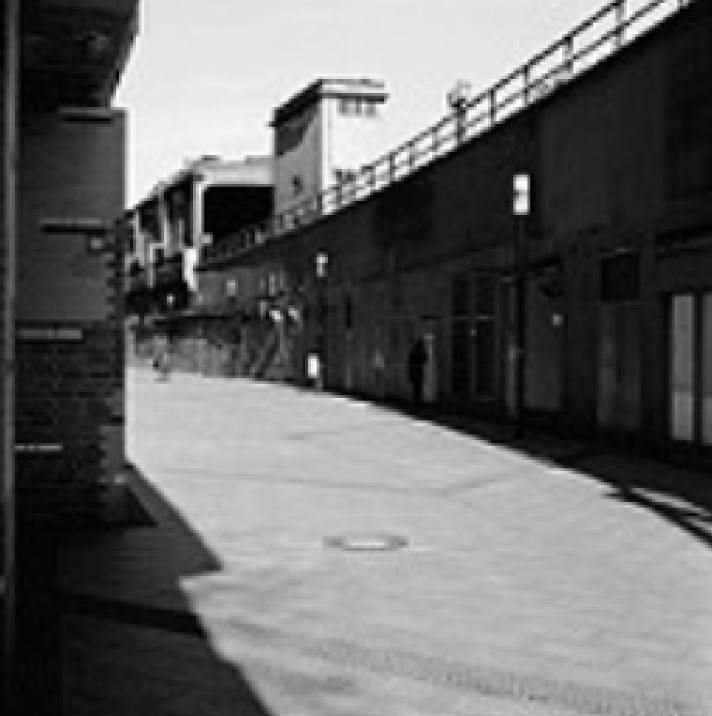
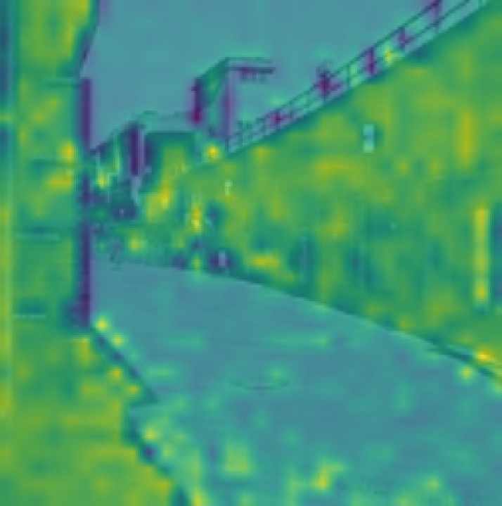

# Scene Classification for Robotics

Deep learning models that help robots recognize and adapt to their visual environment.

## Project Overview

This project tackles scene classification so an agent can adapt its behavior to the surrounding environment. It compares ConvNet, ResNet-18, DenseNet, and Vision Transformer models across Intel Images, Places-205, and a custom Places-17 relabeling. Full methodology, architecture details, and discussion are available in [report.pdf](report.pdf).

## Repository Structure

```text
.
├── ConvNet/                         # ConvNet experiments
├── ResNet/                          # ResNet-18 experiments
├── DenseNet/                        # DenseNet experiments
├── ViT/                             # Vision Transformer experiments
├── report/                          # LaTeX source and figures
└── report.pdf                       # Full technical report
```

## Compute Environment and Limitations

All experiments were run using Kaggle's free GPU resources, specifically an NVIDIA P100 GPU with a 12-hour session limit. Because of this constraint, training runs were often stopped by the provider timeout before full convergence.

To work within these limits, the models were implemented using lighter configurations where possible. The reported results should therefore be interpreted in the context of constrained compute. Longer uninterrupted training, larger model variants, and more extensive hyperparameter tuning could potentially lead to significantly improved performance.

## Results Summary

| Dataset | Best Model | Approx. Accuracy | Takeaway |
|---|---:|---:|---|
| Intel Images | ConvNet / ResNet / DenseNet | ~90% | CNN-based models validate well on a standard benchmark |
| Places-205 | DenseNet | ~40% | Fine-grained scene labels are difficult and often semantically close |
| Places-17 | DenseNet / ResNet | ~60%+ | Broader task-oriented labels improve practical performance |
| Places with ViT | ViT | Limited | Attention works, but training was constrained by compute |

**Accuracy comparison**

<table>
  <tr>
    <td></td>
    <td></td>
    <td></td>
  </tr>
  <tr>
    <td align="center">Intel Images: standard benchmark</td>
    <td align="center">Places-205: fine-grained labels</td>
    <td align="center">Places-17: broader robotics-oriented labels</td>
  </tr>
</table>

On Intel Images, the more homogeneous benchmark, ConvNet, ResNet, and DenseNet show similarly strong accuracy; the ViT attention mechanism works, but training was constrained by compute. For Places, relabeling the dataset from 205 fine-grained classes to 17 broader scene categories improved accuracy from ~40% to ~60%+ while producing labels better aligned with robotics use cases.

**Qualitative and interpretability examples**

<table>
  <tr>
    <td></td>
    <td></td>
    <td></td>
    <td></td>
  </tr>
  <tr>
    <td align="center">Correct Places-17 prediction</td>
    <td align="center">Remaining ambiguity from dominant visual elements</td>
    <td align="center">ViT input image</td>
    <td align="center">ViT attention map</td>
  </tr>
</table>

**Main lessons**

- Dataset design matters as much as model architecture.
- Relabeling fine-grained categories can improve both accuracy and usefulness.
- ResNet and DenseNet are the strongest practical choices under limited GPU resources; ViT needs longer training.

## Authors

| Name | Background |
|---|---|
| Louis Hogge | Computer Science & Engineering |
| Julien Vanderheyden | Electrical Engineering |
| Tom Weber | Electrical Engineering |
